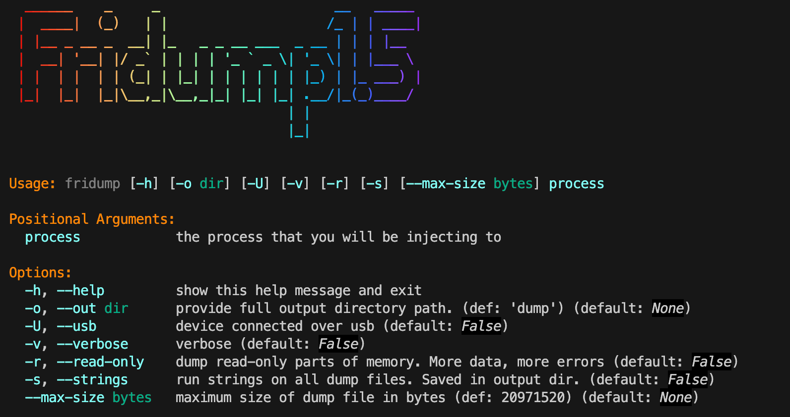

<<<<<<< HEAD
# Fridump 1.5

basically I just fixed some syntax errors and changed the print statements and progress bars to make them cleaner and more in line with python3





---

# Fridump
Fridump (v0.1) is an open source memory dumping tool, primarily aimed to penetration testers and developers. Fridump is using the Frida framework to dump accessible memory addresses from any platform supported. It can be used from a Windows, Linux or Mac OS X system to dump the memory of an iOS, Android or Windows application.
=======
# fridump3
Fridump is an open source memory dumping tool, primarily aimed to penetration testers and developers. Fridump is using the Frida framework to dump accessible memory addresses from any platform supported. It can be used from a Windows, Linux or Mac OS X system to dump the memory of an iOS, Android or Windows application.

This project is based on the following project: [https://github.com/Nightbringer21/fridump](https://github.com/Nightbringer21/fridump) and the pending PR concerning the python3 support (especially from [georgepetz](https://github.com/georgepetz) . Additionally I added the network support in addition to the USB support.

FYI: I will destroy this repo is the Fridump author will integrate the pending PR concerning Python3 support.
>>>>>>> origin

Usage
---

<<<<<<< HEAD
How to:

      fridump [-h] [-o dir] [-U] [-v] [-r] [-s] [--max-size bytes] process

The following are the main flags that can be used with fridump:

      positional arguments:
      process            the process that you will be injecting to

      optional arguments:
      -h, --help         show this help message and exit
      -o dir, --out dir  provide full output directory path. (def: 'dump')
      -U, --usb          device connected over usb
      -v, --verbose      verbose
      -r, --read-only    dump read-only parts of memory. More data, more errors
      -s, --strings      run strings on all dump files. Saved in output dir.
      --max-size bytes   maximum size of dump file in bytes (def: 20971520)

To find the name of a local process, you can use:

      frida-ps
For a process that is running on a USB connected device, you can use:

      frida-ps -U

Examples:

      fridump -U Safari   -   Dump the memory of an iOS device associated with the Safari app
      fridump -U -s com.example.WebApp   -  Dump the memory of an Android device and run strings on all dump files
      fridump -r -o [full_path]  -  Dump the memory of a local application and save it to the specified directory
      
More examples can be found [here](http://pentestcorner.com/introduction-to-fridump/)

Installation
---
To install Fridump you just need to clone it from git and run it:

      git clone https://github.com/Nightbringer21/fridump.git
            
      python fridump.py -h
            
Pre-requisites
---
To use fridump you need to have frida installed on your python environment and frida-server on the device you are trying to dump the memory from.
The easiest way to install frida on your python is using pip:

    pip install frida
    
More information on how to install Frida can be found [here](http://www.frida.re/docs/installation/)

For iOS, installation instructions can be found [here](http://www.frida.re/docs/ios/).

For Android, installation instructions can be found [here](http://www.frida.re/docs/android/).

Note: On Android devices, make sure that the frida-server binary is running as root!

Disclaimer
---
* This is version 0.1 of the software, so I expect some bugs to be present
* I am not a developer, so my coding skills might not be the best

This tool has been tested on a Windows 7 and a Mac OS X laptop, dumping the memory of:  
* an iPad Air 2 running iOS 8.2
* a Galaxy Tab running Cyanogenmod 4.4.4
* a Windows 7 laptop.
 
Therefore, if this tool is not working for you, I apologise and I will try to fix it.

Any suggestions and comments are welcome!
=======
```
usage: fridump [-h] [-o dir] [-u] [-H HOST] [-v] [-r] [-s] [--max-size bytes] process

positional arguments:
  process               the process that you will be injecting to

optional arguments:
  -h, --help            show this help message and exit
  -o dir, --out dir     provide full output directory path. (def: 'dump')
  -u, --usb             device connected over usb
  -H HOST, --host HOST  device connected over IP
  -v, --verbose         verbose
  -r, --read-only       dump read-only parts of memory. More data, more errors
  -s, --strings         run strings on all dump files. Saved in output dir.
  --max-size bytes      maximum size of dump file in bytes (def: 20971520)
```
>>>>>>> origin
